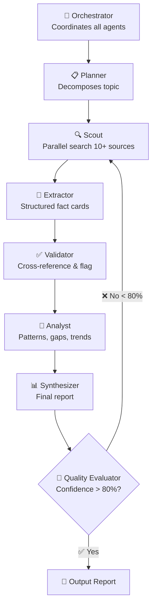

# IdeaScout · 研究 Agent 群

> One question, six experts, one trusted report.
> 一个问题，六个专家，一份可信任的研究报告。

IdeaScout is a **multi-agent deep research framework**. Given a topic, it orchestrates 6 specialized agents — Planner, Scout, Extractor, Validator, Analyst, and Synthesizer — to produce a structured research report with **confidence scoring**, **contradiction detection**, and automatic **Deep Dive quality loops**.

Built as an open-source [OpenCode/Claude Code skill](SKILL.md), IdeaScout turns any AI coding agent into a self-contained research team.

---

## Architecture



---

## Key Differentiators

| Feature | IdeaScout | Perplexity | ChatGPT |
|---------|-----------|------------|---------|
| Multi-Agent Collaboration | ✅ 6 agents | ❌ single | ❌ single |
| Fact Verification | ✅ cross-check | ⚠️ basic | ❌ none |
| Contradiction Detection | ✅ auto-flag | ❌ | ❌ |
| Research Depth | ✅ Deep Dive loops | ⚠️ single pass | ⚠️ single pass |
| Quality Scoring | ✅ confidence score | ❌ | ❌ |
| Source Trust Rating | ✅ tiered scoring | ❌ | ❌ |

---

## Token Consumption

| Scenario | Token Usage |
|----------|-------------|
| Single round | ~140K |
| Deep Dive +1 | +60K |
| Full 3-round research | ~320K |
| 50 researches/day (heavy user) | ~7M/day |
| Monthly (50/day × 30) | ~210M/month |

---

## Confidence Scoring

```
Score = Source Trust × 30% + Timeliness × 20% + Cross-Validation × 30% + Consistency × 20%
```

| Source Type | Trust |
|------------|-------|
| Official data | 100% |
| Professional media | 80% |
| Community / user tests | 60% |
| Blog / self-media | 40% |
| Anonymous | 20% |

---

## Quick Start

```bash
git clone https://github.com/Shanguier/ideascout.git
cd ideascout

# Run demo
PYTHONIOENCODING=utf-8 python3 scripts/research_agent.py "小米 SU7 vs Model 3 对比分析"
```

---

## Report Structure

```markdown
# [Topic] Research Report

## Executive Summary
One-paragraph key takeaway.

## Key Findings
- Finding 1: [source A + source B]
- Finding 2: [conflict detected between C and D]

## Contradictions
| Conflict | Source A | Source B | Suggested Resolution |
|----------|----------|----------|---------------------|
| Price | 21.59万 | 22.99万 | Trust official data |

## Data Comparison
| Dimension | Option A | Option B |
|-----------|----------|----------|
| Price | ... | ... |

## Confidence Score
Overall: 85/100
- Data Completeness: 90%
- Source Trust: 85%
- Contradiction Handling: 100%

## Next Steps
- Suggest additional data on X
```

---

## Tech Stack

- Pure Python — no external API dependencies
- Local processing — data never leaves your machine
- SKILL.md driven — runs inside Claude Code

## License

MIT
